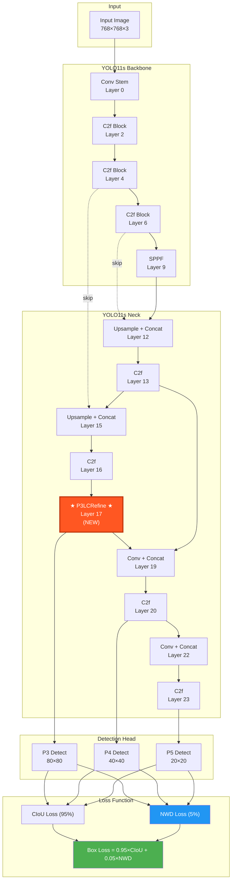
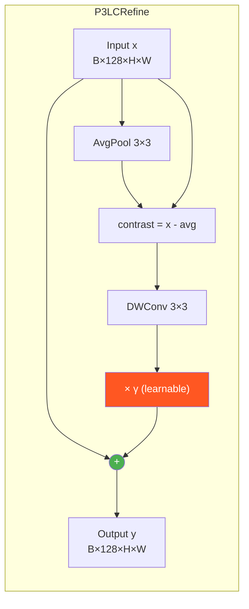

# Bubble-YOLO11s Architecture



## P3LCRefine Internal Structure



## NWD Loss Flow

```mermaid
graph LR
    subgraph NWD
        PB[Pred Box<br/>x1,y1,x2,y2] --> G1[2D Gaussian<br/>N(μ, Σ)]
        TB[Target Box<br/>x1,y1,x2,y2] --> G2[2D Gaussian<br/>N(μ, Σ)]
        G1 --> W[Wasserstein Distance]
        G2 --> W
        W --> E["exp(-W²/C)"]
        E --> NWD[NWD Similarity]
        NWD --> LOSS["L_NWD = 1 - NWD"]
    end
    
    subgraph Fusion
        CIOU[CIoU Loss] --> BL["Box Loss<br/>= 0.95×CIoU<br/>+ 0.05×NWD"]
        LOSS --> BL
    end
    
    style W fill:#2196F3,color:white
    style BL fill:#4CAF50,color:white
```

## Key Numbers

| Metric | Value |
|--------|-------|
| Total Parameters | 9,414,340 |
| P3LCRefine Parameters | ~1,280 (0.013%) |
| FLOPs | 21.3G |
| Inference Time (V100) | ~4.0 ms/img |
| Input Resolution | 768 × 768 |
| Number of Classes | 1 (bubble) |
